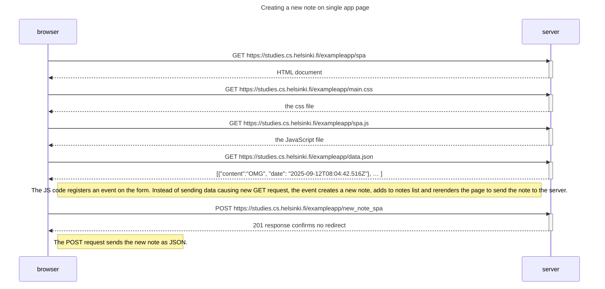

```mermaid
---
title: Creating a new note on single app page
---
sequenceDiagram
    participant browser
    participant server

    browser->>server:  GET https://studies.cs.helsinki.fi/exampleapp/spa
    activate server
    server-->>browser: HTML document
    deactivate server

    browser->>server: GET https://studies.cs.helsinki.fi/exampleapp/main.css
    activate server
    server-->>browser: the css file
    deactivate server

    browser->>server: GET https://studies.cs.helsinki.fi/exampleapp/spa.js
    activate server
    server-->>browser: the JavaScript file
    deactivate server

    browser->>server: GET https://studies.cs.helsinki.fi/exampleapp/data.json
    activate server
    server-->> browser: [{"content":"OMG", "date": "2025-09-12T08:04:42.516Z"}, … ]
    Deactivate server

    Note right of browser: The JS code registers an event on the form. Instead of sending data causing new GET request, the event creates a new note, adds to notes list and rerenders the page to send the note to the server. 

    browser->>server: POST https://studies.cs.helsinki.fi/exampleapp/new_note_spa
    activate server
    server-->> browser: 201 response confirms no redirect
    Deactivate server

    Note right of browser: The POST request sends the new note as JSON. 
```