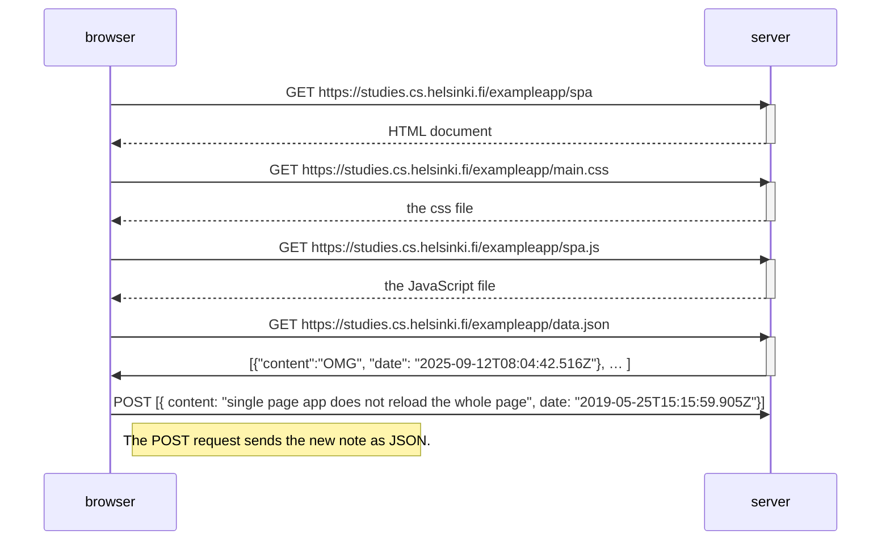

```mermaid
sequenceDiagram
    participant browser
    participant server

    browser->>server:  GET https://studies.cs.helsinki.fi/exampleapp/spa
    activate server
    server-->>browser: HTML document
    deactivate server

    browser->>server: GET https://studies.cs.helsinki.fi/exampleapp/main.css
    activate server
    server-->>browser: the css file
    deactivate server

    browser->>server: GET https://studies.cs.helsinki.fi/exampleapp/spa.js
    activate server
    server-->>browser: the JavaScript file
    deactivate server

    browser->>server: GET https://studies.cs.helsinki.fi/exampleapp/data.json
    activate server
    server->> browser: [{"content":"OMG", "date": "2025-09-12T08:04:42.516Z"}, … ]
    Deactivate server

    browser->>server: POST [{ content: "single page app does not reload the whole page", date: "2019-05-25T15:15:59.905Z"}]
    activate server

    Note right of browser: The POST request sends the new note as JSON. 
```